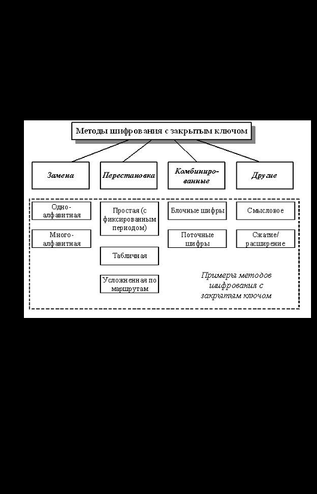
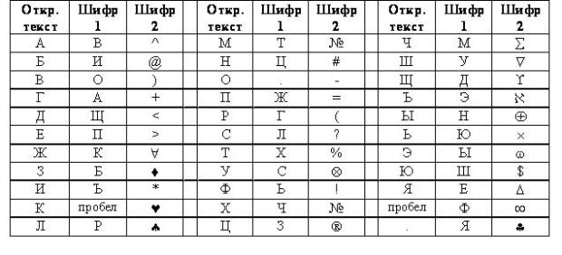
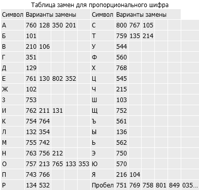

# Лабораторная работа №11

## Тема: «Методы шифрования с закрытым ключом»

### Цель:
Получение практических навыков работы по шифрованию методами с закрытым ключом.

---

**Известны разные методы шифрования с закрытым ключом (рис. 1).** На практике широко используются алгоритмы перестановки, подстановки, а также комбинированные методы.

### Методы перестановки и подстановки

В методах перестановки символы исходного текста меняются местами друг с другом по определенному правилу. В методах замены (подстановки) символы открытого текста заменяются некоторыми эквивалентами шифрованного текста.

### Комбинированные методы

С целью повышения надежности шифрования, текст, зашифрованный с помощью одного метода, может быть еще раз зашифрован с помощью другого метода. В этом случае получается комбинированный или композиционный шифр.

### Современная криптография

Основное отличие современной криптографии от криптографии "докомпьютерной" заключается в том, что раньше криптографические алгоритмы оперировали символами естественных языков, например, буквами английского или русского алфавитов. Эти буквы переставлялись или заменялись другими по определенному правилу.

В современных криптографических алгоритмах используются операции над двоичными знаками, т.е. над нулями и единицами. Основными операциями при шифровании также являются перестановка или подстановка. Для повышения надежности шифрования эти операции комбинируются и многократно циклически повторяются.

## Методы замены

**Методы шифрования заменой (подстановкой)** основаны на том, что символы исходного текста, обычно разделенные на блоки и записанные в одном алфавите, заменяются одним или несколькими символами другого алфавита в соответствии с принятым правилом преобразования.

### Одноалфавитная замена

Одним из важных подклассов методов замены являются одноалфавитные (или моноалфавитные) подстановки, где устанавливается однозначное соответствие между каждым знаком aᵢ исходного алфавита сообщений A и соответствующим знаком eᵢ зашифрованного текста E. Одноалфавитная подстановка иногда называется простой заменой, так как является самым простым шифром замены.

Примером одноалфавитной замены является шифр Цезаря. В общем случае при одноалфавитной подстановке происходит однозначная замена исходных символов их эквивалентами из вектора замен (или таблицы замен). При таком методе шифрования ключом является используемая таблица замен.

### Методы перестановки

При использовании **шифров перестановки** входной поток исходного текста делится на блоки, в каждом из которых выполняется перестановка символов. Простейшим примером перестановки является перестановка с фиксированным периодом d. В этом методе сообщение делится на блоки по d символов, и в каждом блоке производится одна и та же перестановка.

Например, для d=6 в качестве ключа перестановки можно взять 436215. Это означает, что в каждом блоке из 6 символов четвертый символ становится на первое место, третий – на второе, шестой – на третье и так далее. Такие методы перестановки могут быть усилены последовательным применением нескольких перестановок с разными периодами для повышения криптостойкости.

Другим примером методов перестановки является перестановка по таблице. В этом методе производится запись исходного текста по строкам некоторой таблицы и чтение его по столбцам этой же таблицы. Последовательность заполнения строк и чтения столбцов может быть любой и задается ключом.

### Вопросы для самопроверки

1. **Поясните общую схему симметричного шифрования.**
    - Симметричное шифрование использует один и тот же ключ для шифрования и расшифрования данных. Отправитель и получатель должны знать и использовать одинаковый секретный ключ.

2. **Что общего имеют все методы шифрования с закрытым ключом?**
    - Все методы шифрования с закрытым ключом используют один и тот же ключ для шифрования и расшифрования сообщений.

3. **Назовите основные группы методов шифрования с закрытым ключом.**
    - Основные группы методов: методы подстановки, методы перестановки, комбинированные методы.

4. **Приведите примеры шифров перестановки.**
    - Примеры: перестановка с фиксированным периодом, перестановка по таблице.

5. **Сформулируйте общие принципы для методов шифрования подстановкой.**
    - Методы подстановки заменяют символы исходного текста другими символами согласно определенным правилам преобразования.

6. **В чем заключаются многоалфавитные подстановки?**
    - Многоалфавитные подстановки используют несколько алфавитов для шифрования, улучшая безопасность шифра.

7. **Приведите пример шифра одноалфавитной замены.**
    - Пример: шифр Цезаря, где каждая буква заменяется другой буквой с фиксированным сдвигом.

8. **Опишите алгоритм любого метода шифрования перестановкой. Приведите пример шифрования некоторого сообщения этим методом. Каков алгоритм расшифрования в этом методе?**
    - **Пример: Перестановка с фиксированным периодом**
        - Алгоритм шифрования: Разбить сообщение на блоки, переставлять символы в каждом блоке согласно ключу.
        - Пример: Исходное сообщение - "HELLO_WORLD", ключ - "3421".
        - Зашифрованное сообщение - "OLLEH_DLWR".

9. **К какой группе методов шифрования с закрытым ключом относится метод с использованием таблицы Вижинера? Каковы алгоритмы шифрования и расшифрования в этом методе? Приведите пример шифрования некоторого сообщения этим методом.**
    - **Ответ:** Относится к комбинированным методам. Алгоритм: использует таблицу ключей для многократного шифрования. Пример: Исходное сообщение - "CRYPTO", ключ - "KEY", зашифрованное сообщение - "LXFOPV".

10. **Каким образом можно зашифровать и расшифровать сообщение методом табличной перестановки, если размер шифруемого сообщения не кратен размеру блока?**
    - Для зашифровки/расшифровки неполного блока данных, можно использовать дополнение (padding) или игнорировать оставшуюся часть сообщения.

11. **Что такое монофонические шифры?**
    - Монофонические шифры заменяют каждую букву на один и тот же символ, обеспечивая однозначное соответствие между символами исходного и зашифрованного текста.

### Практические задания

1. **Расшифруйте сообщения, зашифрованные с помощью шифра №1:**
    - И.РЮУ.ЪФОБГНО
    - CЛХГ.ЪЛХО.ФОО.ЩВ
   > Имеется таблица замены для двух шифров простой замены: шифра №1 и шифра №2.
   > 

2. **Расшифруйте сообщения, зашифрованные с помощью шифра №2:**
    - _Ваш ответ_
   > Имеется таблица замены для двух шифров простой замены: шифра №1 и шифра №2.
   > 

3. **Зашифруйте с помощью шифра Вижинера и ключа ЯБЛОКО сообщения:**
    - КРИПТОСТОЙКОСТЬ
    - ГАММИРОВАНИЕ

4. **Расшифруйте сообщения, зашифрованные с помощью шифра Вижинера и ключа ОРЕХ:**
    - ШВМБУЖНЯ
    - ЯБХЪШЮМХ

5. **Первый байт фрагмента текста в шестнадцатеричном виде имеет вид А5. На него накладывается по модулю два 4-х битовая гамма 0111 (в двоичном виде). Что получится после шифрования?**
    - _Ваш ответ_

6. **Первый байт фрагмента текста, зашифрованного методом гаммирования (по модулю 2), в шестнадцатеричном виде имеет вид 9А. До шифрования текст имел первый байт, равный 74 (в шестнадцатеричном виде). Какой ключ использовался при шифровании?**
    - _Ваш ответ_

7. **Зашифруйте методом перестановки с фиксированным периодом d=6 с ключом 436215 сообщения:**
    - ЖЕЛТЫЙ_ОГОНЬ
    - МЫ_НАСТУПАЕМ

8. **Расшифруйте сообщения, зашифрованные методом перестановки с фиксированным периодом d=8 с ключом 64275813:**
    - СЛПИЬНАЕ
    - РОИАГДВН

9. **Определите ключи в системе шифрования, использующей перестановку с фиксированным периодом d=5 по парам открытых и зашифрованных сообщений:**
    - МОЙ ПАРОЛЬ – ЙПМ ООЬАЛР
    - СИГНАЛ БОЯ – НИСАГО ЛЯБ

10. **Зашифруйте сообщения методом перестановки по таблице 5*5. Ключ указывает порядок считывания столбцов при шифровании:**
- ШИРОКОПОЛОСНЫЙ УСИЛИТЕЛЬ (ключ: 41235)
- ПЕРЕДАЧА ИЗОБРАЖЕНИЯ (ключ: 24513)

11. **Расшифруйте сообщения, зашифрованные методом перестановки по таблице 4*4 (символ подчеркивания заменяет пробел). Ключ указывает порядок считывания столбцов при шифровании:**
- ЕАУПД_КЕАЗАРЧВ (ключ: 4123)
- А_НСЫИЛБСАЛЙГ (ключ: 3142)

12. **Расшифруйте указанные сообщения, зашифрованные шифром пропорциональной замены:**
    - 353214764134136759136762849754128212350354035767106216753211
    - 351 761756130532128759353134758105757213101752352763211762
   > Известно, что при использовании шифра пропорциональной замены каждой русской букве поставлено в соответствие одно или несколько трехзначных чисел по таблице замен:
   > 
   